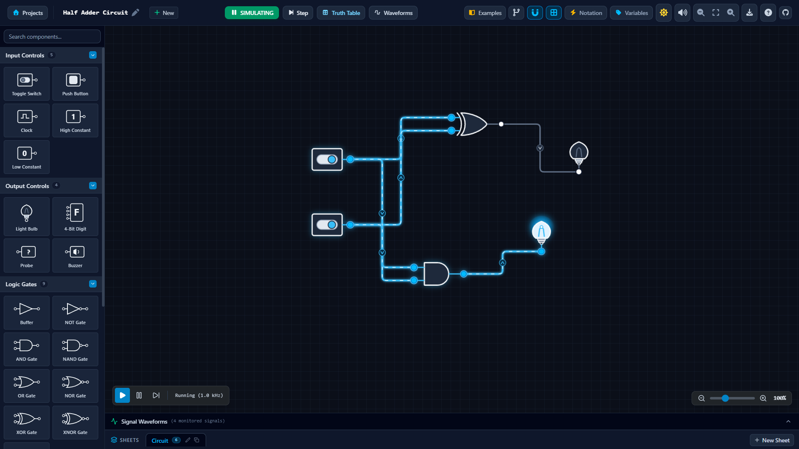
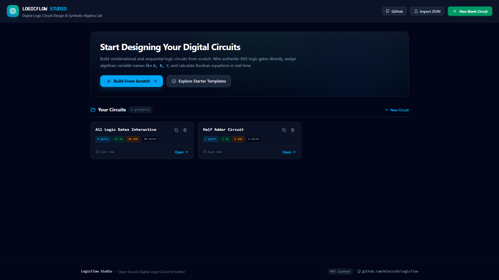
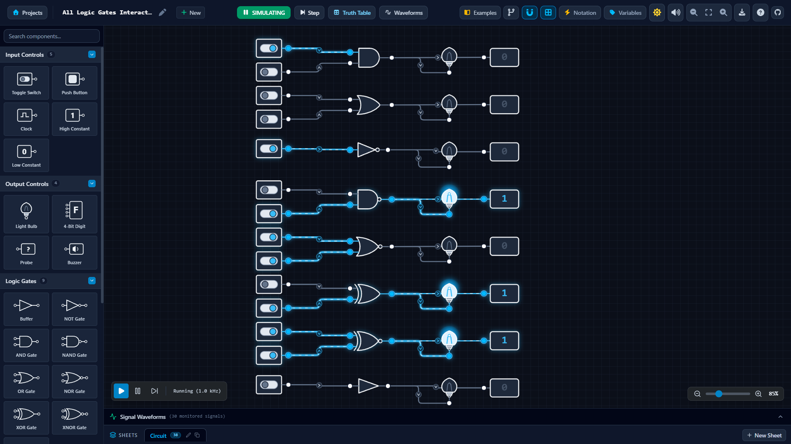

# LogixFlow ⚡
> Modern, interactive logic gate visualizer and digital circuit simulation studio with real-time signal flow, symbolic Boolean algebra, and oscilloscope timing waveforms.

[](https://opensource.org/licenses/MIT)
[](https://github.com/ktesla39/LogixFlow)

LogixFlow is an electronic design automation (EDA) and digital logic simulator built for students, educators, and engineers. Design combinational and sequential logic circuits from scratch, observe dynamic electron/signal flow propagation in real time, analyze Boolean expressions algebraically, and simulate digital clock cycles with precision.

Official Repository: [https://github.com/ktesla39/LogixFlow](https://github.com/ktesla39/LogixFlow)

---

## ✨ Key Features

- **⚡ Real-Time Circuit Simulation**: Instant propagation solver supporting feedback latches, flip-flops, adders, clocks, and oscillators.
- **🌊 Dynamic Circuit Flow Notation**: Beautiful, high-fidelity visual indication of active signal flow, logic level states (`[1] HIGH` / `[0] LOW`), and direction of electron flow from drivers to loads.
- **🔌 Intuitive, Glitch-Free Wiring**: Supports both seamless click-to-connect and drag-to-connect with magnetic terminal snapping, multi-output fan-out, and auto-orthogonal or curved routing.
- **📐 Authentic ANSI/IEEE Standard Gate Symbols**: Clean schematic representations for AND, OR, NOT, NAND, NOR, XOR, XNOR, Buffers, Tri-State, and configurable multi-input gates (2 to 8 inputs).
- **💡 Rich Interactive Components**:
  - **Inputs**: Toggle Switches, Push Buttons, Clock Oscillators, High/Low Constants.
  - **Outputs**: Light Bulbs, 4-Bit Hexadecimal/Decimal Digit Displays, Interactive Logic Probes, Piezo Buzzers.
  - **Sequential Logic**: D Flip-Flops, T Flip-Flops, JK Flip-Flops, SR Flip-Flops.
  - **Combinational Blocks**: Half Adders, Full Adders, 2:1 Multiplexers, 1:2 Demultiplexers.
- **🧮 Symbolic Boolean Algebra Engine**: Automatically derives, simplifies, and displays mathematical logic expressions (e.g., `(A · B) + ¬C`) across wires and probes.
- **📊 Digital Oscilloscope / Timing Diagrams**: Real-time multi-channel waveform capture for clock pulses and sequential state transitions.
- **📑 Multi-Sheet Circuit Projects**: Organize large systems across multiple schematic sheets with tab management, cloning, and instant switching.
- **🌗 Polished Light & Dark Modes**: Fully adaptive high-contrast themes across all toolbars, canvas grids, and component libraries.
- **💾 JSON Export & Import**: Save your circuits locally, share with classmates, or load preset demonstration circuits.

---

## 📸 Screenshots

| circuit showcase | Home Dashboard | Circuit showcase |
|---|---|---|
|  |  |  |

---

## 🚀 Getting Started

### Prerequisites
- [Node.js](https://nodejs.org/) (version 18+ recommended)
- npm, yarn, or pnpm

### Installation

1. Clone the repository:
   ```bash
   git clone https://github.com/ktesla39/LogixFlow.git
   cd LogixFlow
   ```

2. Install dependencies:
   ```bash
   npm install
   ```

3. Start the local development server:
   ```bash
   npm run dev
   ```

4. Open your browser at `http://localhost:3000` to start building circuits.

---

## 🎮 Controls & Shortcuts

| Action | Control / Shortcut |
|---|---|
| **Add Component** | Drag from sidebar or click component card |
| **Connect Wire** | Click or drag from any terminal pin to a target pin (supports magnetic snapping) |
| **Cancel Wire Creation** | Press `Escape`, right-click, or click empty canvas |
| **Inspect Component** | Right-click component or double-click / double-tap |
| **Pan Canvas** | Click and drag canvas background (or middle-click drag) |
| **Zoom In / Out** | Mouse wheel or slider in bottom right |
| **Delete Selected** | `Delete` or `Backspace` key |
| **Toggle Switch** | Click on the switch lever directly |
| **Press Button** | Click and hold the push button |
| **Step Clock** | Click "Step" in top toolbar while paused |

---

## 📄 License

This project is licensed under the **MIT License** - see the [LICENSE](LICENSE) file for details.

Developed with care by [ktesla39](https://github.com/ktesla39/LogixFlow). Contributions and feedback are warmly welcomed!
